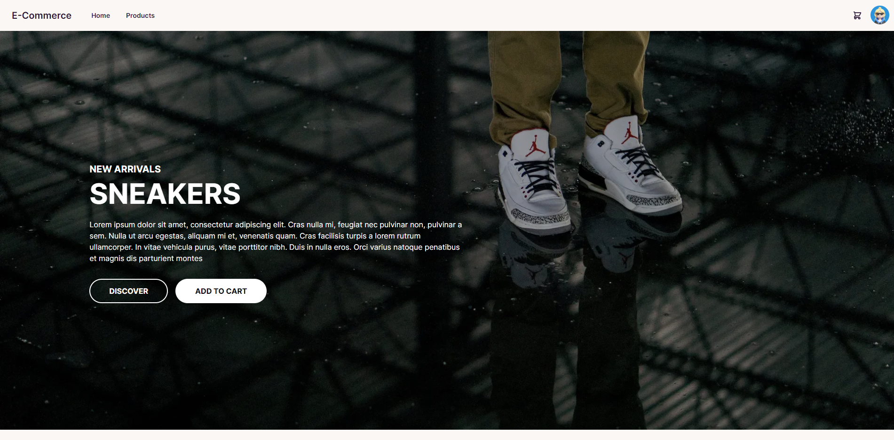

<div align="center">

# Ecommerce



</div>


# Gateway API

This project implements a set of API gateways for managing users, products, and Google authentication using the Fiber web framework in Go.

## Getting Started

### Prerequisites

- Go 1.22+
- Fiber v2

### Installation

1. Clone the repository:
   ```sh
   git clone https://github.com/Rachanonnn/go-ecommerce
   cd go-ecommerce
   cd Backend
   ```

2. Install dependencies:
   ```sh
   go mod tidy
   ```

## .env file
```
DATABASE_NAME=
MONGODB_URI=
DB_PORT_LOGIN=

JWT_SECRET_KEY=
JWT_REFESH_SECRET_KEY=

# Google Auth
G_CLIENT_ID=
G_CLIENT_SECRET=

# Make sure this value is the same as the one that we initialize 
# in the google console before.
G_REDIRECT="http://localhost:8000/api/v1/google_callback"
```

### Running the Application

Start the application using the following command:
```sh
go run .
```

## API Endpoints Backend

### User Management

Base URL: `/api/v1/profile`

- **POST /add_user**: Create a new user account
- **GET /users**: Retrieve all user data
- **GET /get_user_by_id**: Get user data by ID
- **PUT /update_user**: Update user information
- **DELETE /delete_users**: Delete a user account
- **GET /get_address_by_user_id**: Get address by user ID
- **POST /add_address**: Add a new address
- **PUT /update_address**: Update an existing address
- **DELETE /delete_address**: Delete an address
- **GET /get_orders_by_user_id**: Get orders by user ID
- **POST /add_order**: Add a new order to the cart
- **PUT /update_order**: Update an order
- **DELETE /delete_order**: Delete an order

### Product Management

Base URL: `/api/v1/product`

- **GET /get_all_products**: Retrieve all products
- **GET /get_product_by_id**: Get product data by ID
- **POST /add_product**: Create a new product
- **PUT /update_product**: Update product information
- **DELETE /delete_product**: Delete a product

### Google Authentication

Base URL: `/api/v1`

- **GET /google**: Initiate Google authentication
- **GET /google_callback**: Google authentication callback

## Project Structure

- **gateways**: Contains the gateway functions for user and product management.
- **main.go**: Entry point of the application.

# Frontend

## Getting Started
```
cd go-ecommerce/Frontend
npm run dev
```

Open [http://localhost:3000](http://localhost:3000) with your browser to see the result.

## Contributing

Please feel free to submit issues, fork the repository, and send pull requests.

# Trello
- https://trello.com/b/57zHhoiC/ecommerce

# Changelog

## 1.1
- frontend | feat : add icon and add button clear
- frontend | merge branch feature/add-product-recheck to develop and remove https://trello.com/c/s9unRXEJ/4-feature-add-product-recheck

## 1.0
- backend | add uid generate when user sign in to database
- backend | add token generate when user sign in to database
- backend | support sign in with firebase email and password

# To-Do Backend

- [x] Google OAuth 2.0

- [x] CRUD UserData

- [x] CRUD Product

- [x] CRUD Address

- [ ] Log Product

- [ ] Search Product

- [ ] List Cart

- [ ] Payment

# To-Do Frontend
- [ ] after register then send user data to backend
